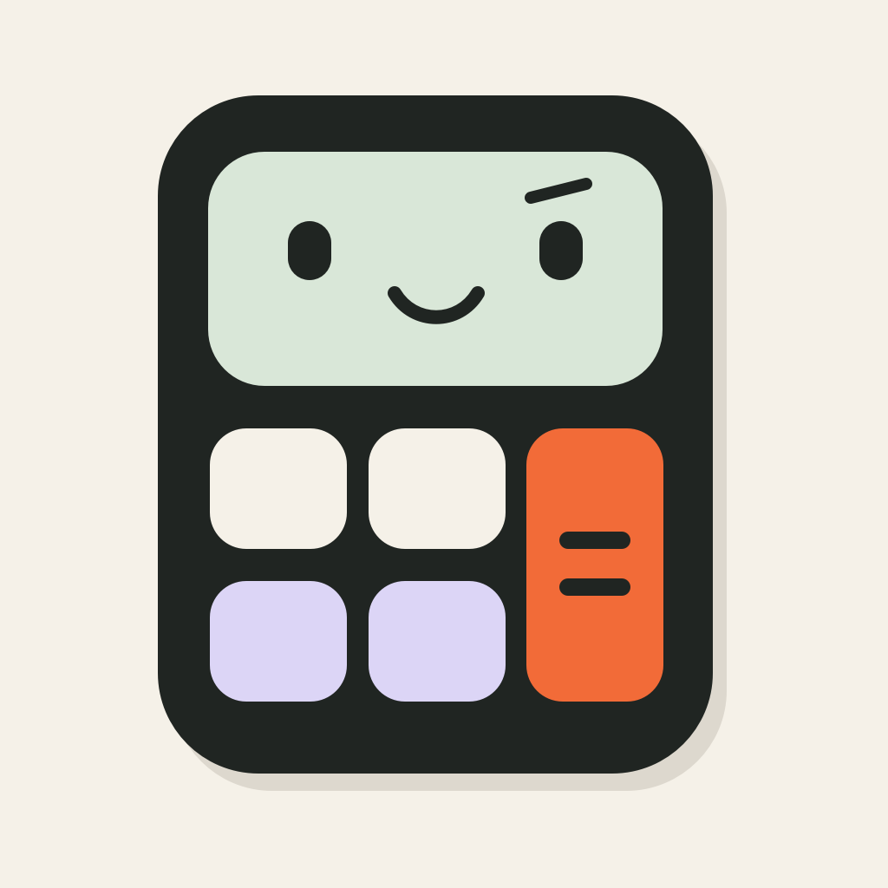
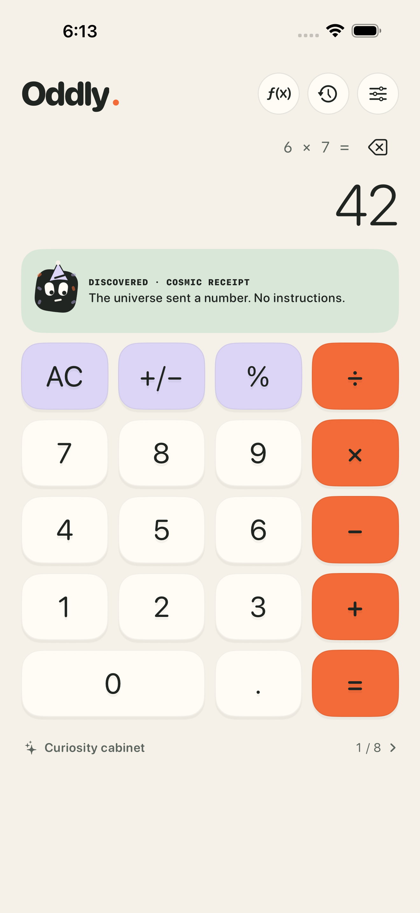
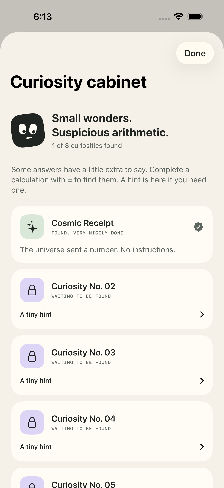

# Oddly

**Serious math. Tiny nonsense.**



A native iPhone and iPad calculator with a warm paper palette, satisfying keys, a curious little companion, and eight numerical discoveries. Built in SwiftUI. Open source under the MIT license. No ads, tracking, accounts, backend, or third-party dependencies.

**Release status:** working iOS app; core and Simulator tests pass, and an unsigned Release archive builds successfully. Not yet published on the App Store. See [QA evidence](docs/QA.md) and the [App Store release guide](docs/release/APP_STORE.md) for completed checks and remaining gates. The working name has not been reserved in App Store Connect.

 

Actual iPhone 16 Pro Max Simulator captures from the passing UI suite. Validation includes 47 core tests, 18 coordinator checks, nine baseline iOS workflows, and two supplemental workflows at the largest accessibility text size on iPhone SE. See the QA report for scope and remaining device checks.

## A calculator with character

- Decimal arithmetic, contextual percentages, sign, backspace, and repeat equals.
- Square, square root, reciprocal, and pi within reach in portrait.
- Up to 100 recent calculations, stored locally, with exact-result recall and copy.
- Calm, Playful, and Unhinged personalities. The jokes never change the math.
- Eight collectible discoveries with hints; no streaks, accounts, or nagging.
- Light/dark appearance, optional haptics, accessible controls, and reduced-motion support.
- Adaptive layouts for iPhone and iPad.

Try `6 × 7 =`. The universe's accounting department has entered the chat.

## Run

Install **Xcode 26 or later** and an iOS Simulator runtime. Open `Oddly.xcodeproj`, select the **Oddly** scheme and an iPhone Simulator, then Run. Deployment target: iOS 17+. The checked-in project uses the local `CalculatorCore` Swift package; there are no package downloads.

```sh
swift test
bash scripts/test-model.sh
python3 scripts/validate-project.py
bash scripts/test-ios.sh
```

To run on your own iPhone, copy `Oddly/Signing.example.xcconfig` to `Oddly/Signing.xcconfig` and set your team and unique bundle identifier. The signing file stays out of Git. The default `com.example.oddly.calculator` is for local development only.

After adding/removing app or UI-test source files, regenerate the committed project:

```sh
python3 scripts/generate-project.py
```

The project generator uses Python's standard library. The icon is original, code-drawn artwork; regenerate it on macOS with `swift scripts/render-icon.swift`.

An optional shared-SwiftUI macOS preview is available through `bash scripts/build-mac-preview.sh`. It is a development aid, not the iOS product or a substitute for iOS testing.

## How the math works

Oddly uses immediate execution, like a pocket calculator. `2 + 3 × 4 =` produces **20**: entering × first resolves 2 + 3, and the breadcrumb changes to `5 ×`. The app never displays an algebraic expression that implies a different result.

| Input | Result |
| --- | --- |
| `0.1 + 0.2 =` | `0.3` |
| `200 + 10% =` | `220` |
| `200 − 10% =` | `180` |
| `200 × 10% =` | `20` |
| `200 ÷ 10% =` | `2000` |
| `5 + 2 = =` | `9` |

The core uses Foundation `Decimal`, with up to 38 significant decimal digits internally and an 18-digit manual entry limit. Nonterminating results round to Decimal's precision. Display formatting may abbreviate long results; copy and recall use the stored canonical decimal. Square root uses decimal Newton iteration after a floating-point seed. Out-of-range operations and invalid real-number domains produce recoverable errors. This is an everyday calculator, not a symbolic algebra system.

## Project map

| Path | Purpose |
| --- | --- |
| `Sources/CalculatorCore` | Independent calculation, history, and personality models |
| `Oddly` | SwiftUI app, local state, native assets, privacy manifest |
| `Tests/CalculatorCoreTests` | Arithmetic/state/persistence/personality regression tests |
| `OddlyUITests` | Real-app XCUITest workflows |
| `scripts` | Reproducible project, asset, test, preview, and archive tools |
| `docs` | Research, design decisions, humor catalogue, privacy, QA, release materials |

The development process used a control room, designer/architect, funny designer, implementer, and independent QA. They explicitly challenged arithmetic notation, excessive interruptions, and unsupported feature promises. [Market research](docs/MARKET_RESEARCH.md), [design decisions](docs/PRODUCT_DESIGN.md), and [humor rules](docs/HUMOR_DESIGN.md) record the reasoning.

## Publish and contribute

The repository is ready to be hosted on a Git service. A public remote has not been created automatically. After signing into GitHub, the owner can create a repository and push this local project. Do not include local signing credentials.

For App Store distribution, follow [the release guide](docs/release/APP_STORE.md). It includes draft store copy, full Easter-egg reviewer notes, privacy guidance, and the archive workflow. Publication requires the publisher's active Apple Developer membership and Apple's approval.

See [CONTRIBUTING.md](CONTRIBUTING.md), [SECURITY.md](SECURITY.md), and [privacy policy](docs/PRIVACY.md). All original code and artwork are [MIT licensed](LICENSE).
